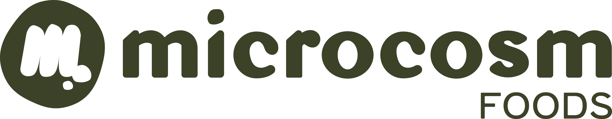

**Welcome to @MicrocosmFoods!**

We are on a mission to make the benefits of fermentation accessible to all while producing public goods. You can learn about what we are doing by: 

- Exploring and building upon our repositories of open-source tools
- [Reading our newsletter](www.microcosmfoods.substack.com) to follow along with research updates and other fun fermented foods blogs
- [Browsing and reusing our open datasets](https://zenodo.org/communities/microcosmfoods/records?q=&l=list&p=1&s=10) on fermented foods such as curated microbial genomes from fermented foods, predicted molecules from thousands of genomes, and bioactivity predictions of fermented foods peptides
- Questions? Have ideas for collaborations? [Contact us](https://microcosmfoods.github.io/#contact) through our website!

